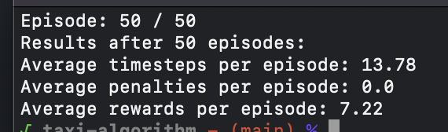

# Taxi algorithm

## Environment preparation

To install every requirement of the python algorithm, you can launch this command at the root of the repository.
```bash
pip3 install -r requirements.txt
```

## Usage
### Vanilla Q learning
Move to the path `Q_learning/`

There is a basic example to use the Q algorithm.
This example launch the algorithm with 35,000 training episodes and 5 testing episodes.
```python
import q_learning as Taxi

taxi = Taxi.Taxi('rgb_array')
taxi.train(train_episodes=35000)
taxi.test(test_episodes=5, timestamp=0.1, fast_testing=False, final_frame_pause=0)
```
#### Variables explanation
When initializing __Taxi.Taxi__ object, you can specify the render mode for the training process. `rgb_array` opens a *matplotlib* window that preview the testing process, whereas `ansi` would preview the training test in the terminal.

###### The __train__ function can take 1 optional variables when processing train episodes.
- `train_episodes` is the number of train episode to execute.
    *If not given, the default value is set to __25,000__*

###### The __test__ function can take up to 4 optional variables when processing test episodes.
- `test_episodes` is the number of test episode to execute.
    *If not given, the default value is set to __1__*
- `timestamp` is the framerate of the testing animation (*x* seconds between each action)
    *If not given, the default value is set to __0.2__*
- `fast_testing` is an option that allow to get rid of the graphical interface in order to significantly improve execution time.
    *If not given, the default value is set to __False__*
- `final_frame_pause` is the duration of the last frame display. This allow you to examinate the results at the end of an episode before launching the next one.
    *If not given, the default value is set to __0__*

## Results
#### During testing


There is 4 real time informations displayed at the top of the window :
- __Action__ is the move that the algorithm just did.
- __Reward__ is the last reward obtained after the last move, knowing that :
    - Each step return -1
    - Successfully delivering a client return +20
    - Illegal pickup and drop-off return -10
- __Episode reward__ is the reward total of the current episode.
- __Episode__ is the number of the episode currently processing.

#### After testing


The final result message shows the __average steps__ made by the algorithm, the __average penalties__ *(illegal moves)*, and the __average reward__ obtained after the full testing process.

### Deep Q learning
Move to the path `deep_Q_learning/`

There is an example for the deep Q algorithm usage.
```python
import deep_q_learning as Taxi

taxi = Taxi.QAgent()
taxi.compile()
taxi.fit()
```
Once executed, you should see a window that will show every informations needed casted in a matplotlib table similar to this one :
.png)

#### Variables explanation
Every environment related variable are defined in the `__init__` function of the __QAgent__ class, which is the main class that manage the entire training process.
Therefore, there is a sample of the default main variables used in the algorithm :
- __model_class__: the variable that point to the neural network
- __memory__ : tha variable that allow us to manage and use the memory of our trained algorithm
- __loss__: the loss function definition (hubert by default)
The rest of the variables are pretty much the same as the vanilla Q learning ones.
#### Test phase note
This algorithme implementation doesn't contain any graphical test function, as it show a very detailed table through the training process, as well as a progress bar to complete theses informations.

Therefore, the algorithm actually save to a file the memory after the training has been done, which can be used to test our trained model.